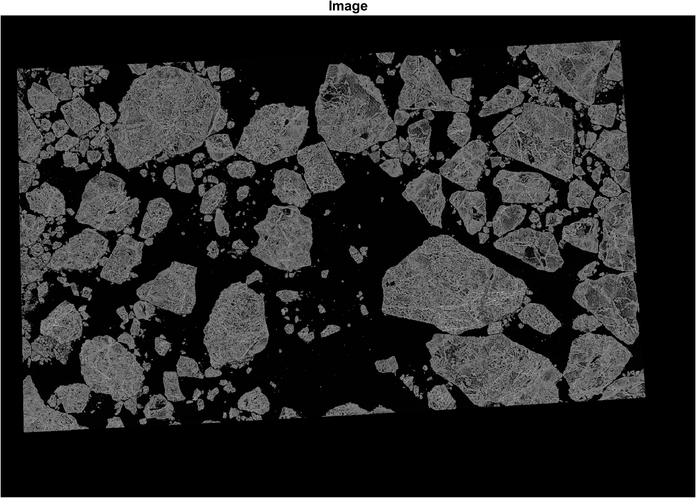
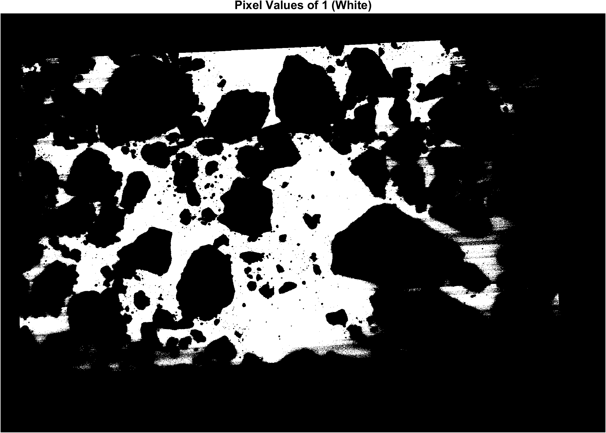
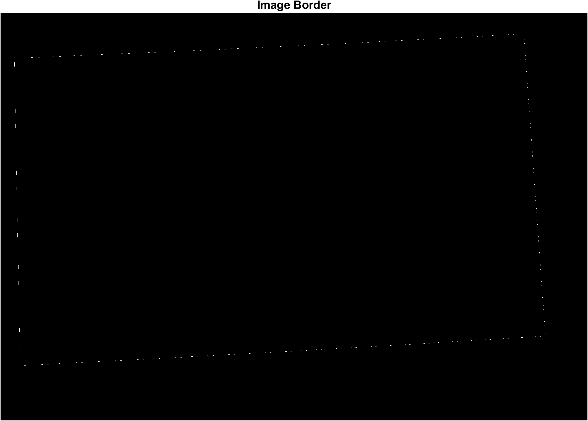
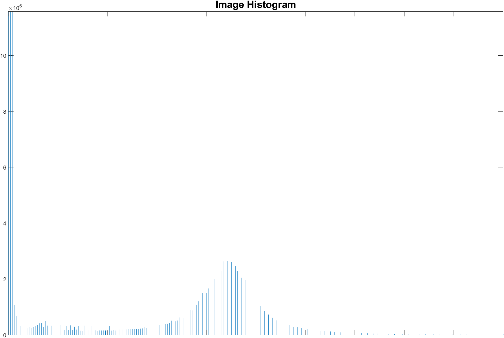
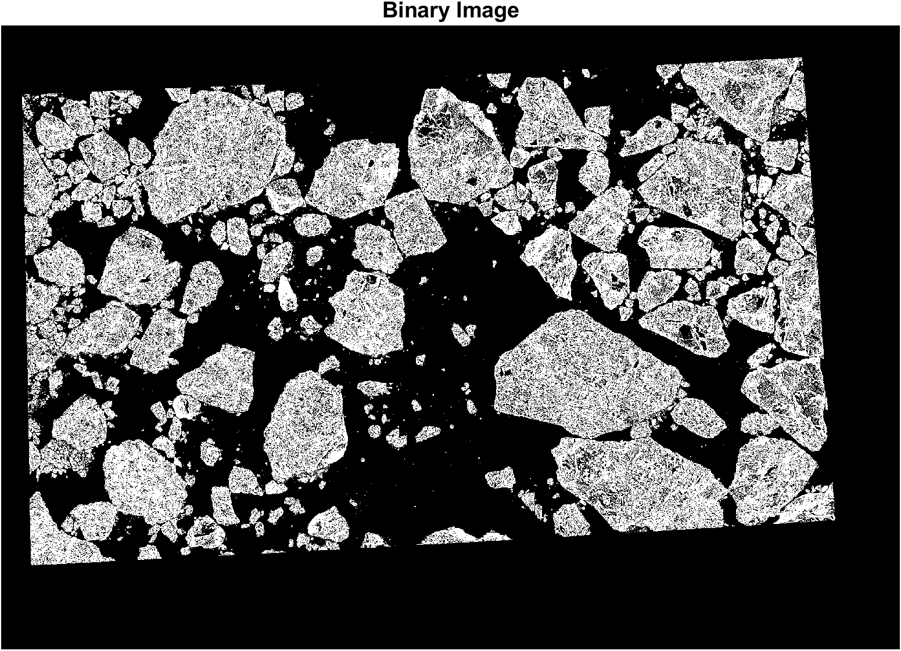
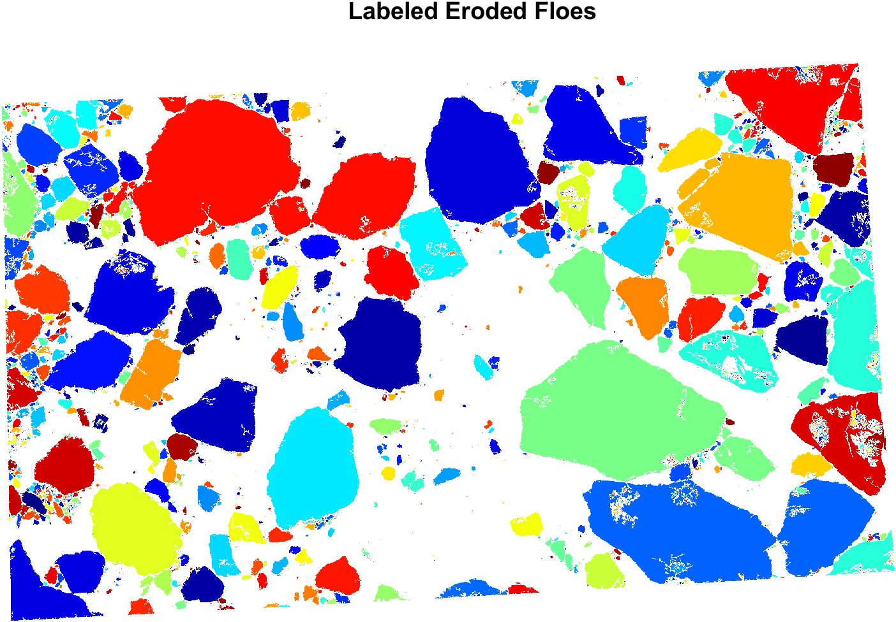
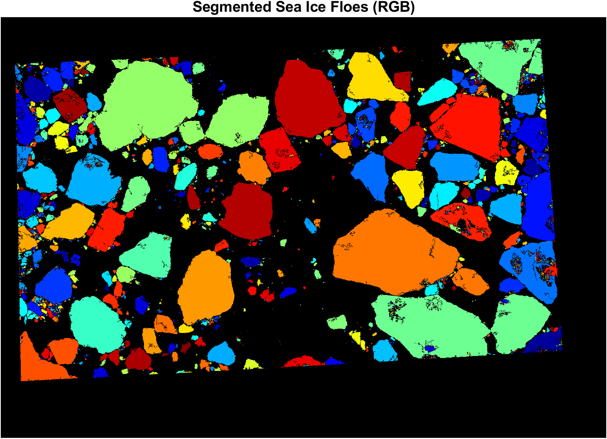
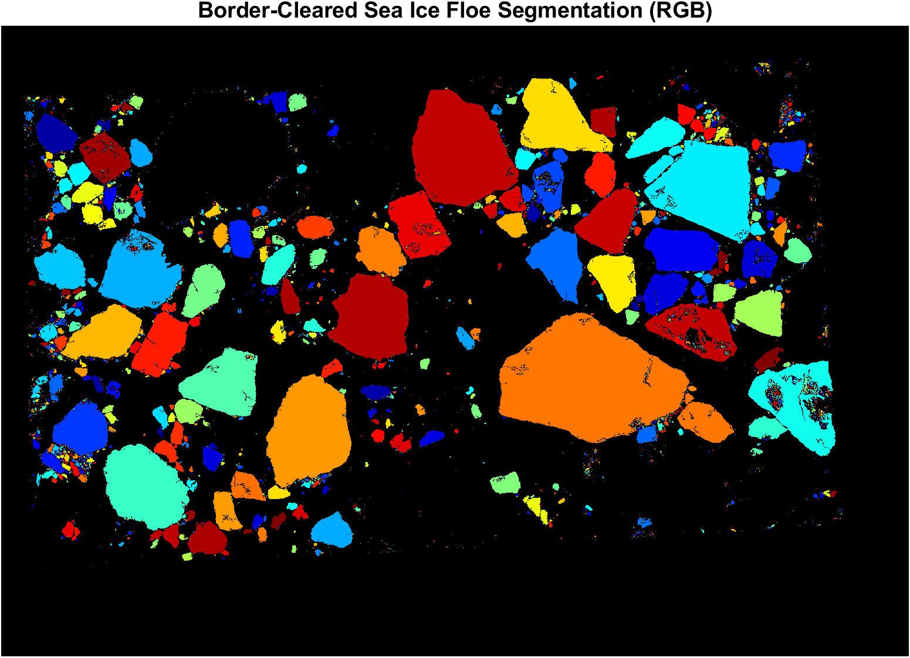

# sea-ice-floe-segmentation

## Description
This repository contains a user-friendly, MATLAB Live Script to easily and automatically segment sea ice floes (chunks) in imagery (for example, from satellites or aerial platforms).

The algorithm and code was written by Alexis Denton (Yale University) for and used to segment high-resolution optical satellite images in the accompanying submitted manuscript (preprint, in review) coauthored with Mary-Louise Timmermans (Yale University), Denton and Timmermans (2021) (https://doi.org/10.5194/tc-2021-368). The development of this code and the research presented in the manuscript was funded by the Office of Naval Research as a part of their Multi-University Research Initiative (MURI) Mathematics and Data Science for Physical Modeling and Prediction of Sea Ice. To learn more about the work of the Sea Ice MURI, please visit https://seaicemuri.org/. 

For further details about the algorithm, please see Denton and Timmermans (2021). 

## Documentation 

### Downloads
The sea ice floe segmentation Live Script is contained in the file sifloeseg.mlx. Download the current release as a full package or this individual file. 

### Requirements
To run this Live Script (.mlx), you will need access to at least the Basic MATLAB install in addition to the following toolboxes:
- Image Processing Toolbox

### How to Run the Live Script
The Live Script is designed to be easy to use; however, a detailed explanation is provided here with an example image and segmentation.

First Steps:

1. Open sifloeseg.mlx in MATLAB. 
2. In the Live Editor tab, under the View subtab, choose Hide Code.

Define parameters and run the Live Script. In the seafloeseg Live Script:

1. In the Import and Check Image section:

   - In the Define Directories subsection, define your:
  
     - Image File Path (where your image file is located)
     - Image File Name (name of your image file including file extension)
     - Segmentation Write Path (where you wish to save the output segmentation files)

   - In the Import Image subsection:
 
     - Click to Import Image

   
   - In the Check Image subsection:
   
     - Check the image for pixel values of 1 outside of the image bounds. Some uncalibrated satellite images are processed to contain image data (such as integer values      similar to actual data values) outside of the sensor view area (this is a known issue in particular with United States Geological Survey Global Fidicual imagery). Answer yes or no to "Pixel values of 1 outside of image bounds only?" and press "Complete Image Check". Choose yes only if there are values of 1 outside of the bounds, and not also inside. If there are similar values outside and inside of the bounds, the image may be segmented but will not be able to be border-cleared of sea ice floes properly (see later).  

   - Verify the image borders visually. 

2. In the Classify Image section:

   - In the Inspect Image Histogram subsection:
   
     - Click to Display Image Histogram

   
   - In the Choose Classification Threshold subsection:
 
     - Use the sliding scale or enter a value to choose the classification threshold (seperating ice [1] from water [0] in the resulting binary image) and Click to Classify Image

   - Once you are happy with your chosen classification threshold, in the Save Classified Image subsection:
  
     - Click to Save Classified Image

3. In the Erode Image section:

   - In the Choose Number of Erosions subsection:
  
     - Choose and enter the number of erosions to erode your image (sea ice floes). Choose an appropriate number to seperate your largest sea ice floes. The hierachical   scheme of the segmentation will erode the largest to smallest floes iteritavely and automatically. See Denton and Timmermans (2021) for further details.

     
4. Once you are content with your chosen parameters (Classification Threshold and Number of Erosions), in the Segment Image section:

   - Click to Segment Image

5. (Optional) If you wish, you can clear any segmented floes from the image borders, as these floes should not be included in certain types of image product analysis, such as Floe Size Distrution (FSD) analysis (see Denton and Timmermans, 2021). In the Clear Border-Intersecting Sea Ice Floes section:

   - Click to Clear Border Floes

6. (Optional) If you have run the border clearing, you can save the border-cleared segmentation. The non-border cleared segmentation files have already been saved at this point in the code. In the Final Steps and Save Sea Ice Floe Segmented Image section:

   - Click to Save Segmented Image

### Output Segmentation Files

In your segmentation write path, you will see 5 files:

1. Classified image (.png) 

      Naming convention: **imagename_bwt000_classified.png** where *bwt* stands for black-white threshold and is followed by the numerical value of your classification threshold used to classify the image.
      
      The classified image is the binary image used in the segmentation of your original image. 
      
4. Segmented image (.png, RGB)

      Naming convention: **imagename_bwt000e00hs_labeled_rgb.png** where *bwt* is again the classification threshold used and *e* stands for erosion and is followed by the number of erosions used to segment the image. *hs* indicates that this implementation of the code uses a half-step hierarchical scheme in which each group of successively smaller floes is segmented using roughly half the number of erosions used in the previous step. *rgb* indicates this is the segmented image represented in color (red-green-blue).
      
      This segmented image is not border-cleared of floes.
      
6. Segmentation MATLAB file (.m)

      Naming convention: **imagename_bwt000e00hs_labeled.m** as above. 
      
      This MATLAB file contains the following segmentation variables and arrays:
      
      - **bw**: classified image array (*logical*)
      - **bwt**: classification threshold (*double*)
      - **cols**: number of image columns (*double*)
      - **L**: for 'Label Array'; segmented image array containing positive integer values (numerical labels) representing uniquely labeled floes and values of 0 representing ocean (rows x cols *double*)
      - **Lrgb**: RGB (red-green-blue) Label Array; segmented image as an RGB image (rows x cols x  3 *uint8*)
      - **numErosions**: vector containing number of erosions used at each hierarchical step (left to right: highest to lowest, where the highest matches the number of erosions chosen (1 x n *double*)
      - **numfmax**: the highest value numerical floe label. This is also the number of floes segmented (*double*)
      - **rows**: number of image rows (*double*)

      This is the non border-cleared segmentation file.
      
8. Border-cleared segmented image (.png, RGB)

      Naming convention: **imagename_bwt000e00hs_bc_labeled_rgb.png** as above and where *bc* stands for border-cleared. 
      
10. Border-cleared segmentation MATLAB file (.m)

      Naming convention: **imagename_bwt000e00hs_bc_labeled.m** as above. 
      
      The file variables are as above but for the border-cleared segmentation. Note that in this instance, **numfmaxbc** indicates the highest value numerical floe label for the boder-cleared segmentation, but not the total number of floes (as specific floe labels are removed during border clearing). 
    
### Segmentation Object Analysis (such as Floe Size Distribution Retrieval)

This segmentation script was designed to be used directly to obtain floe sizes for Floe Size Distribution characterization, but can be used for other analysis, such as for floe shape. For retrieval of floe properties from the labeled arrays **L** in the MATLAB segmentation files, see the MATLAB function **regionprops**. For more on FSD analysis, see Denton and Timmermans (2021).

## References
Denton, A. A. and Timmermans, M.-L.: Characterizing the Sea-Ice Floe Size Distribution in the Canada Basin from High-Resolution Optical Satellite Imagery, The Cryosphere Discuss. [preprint], https://doi.org/10.5194/tc-2021-368, in review, 2021.
